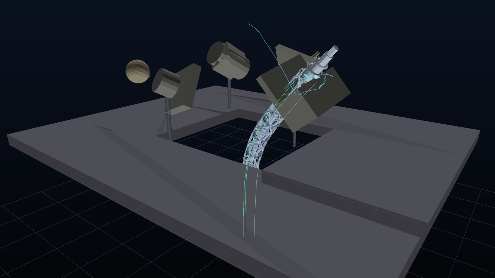

# Hard–Soft Arm Lab — design notes

A browser simulation of the TRUNC / arXiv:2412.02650 arm: a truss-flexure soft
continuum arm whose nine tendons are driven from the base, a rigid-torque
transmission joint at the tool, and a transformer policy that is distilled from
a scripted expert inside a Web Worker. Everything runs offline — no CDN, no
network, no `three.js`; the module graph is plain ES modules served by
`tools/dev-server.mjs`.

## 1. Plant

| element | value | source |
| --- | --- | --- |
| segments | 3 × 0.2367 m, 45° bend limit each | paper §"Design" |
| cables | 9 (3 per segment, ψ ∈ {90°, 210°, 330°}) | paper Fig. 3, TRUNC repo |
| neutral reach | 710 mm | paper |
| compression | 94.3 mm | paper |
| stiffness | truss 0.453 + guide 0.300 + tendon 0.810; ×6 when assembled | `src/core/metamaterial.js` |
| torque transmission | 52× torsion/bending at the joint | paper |
| step | fixed 1/240 s, winch servo at 0.35 m/s, slew limit 0.025 m/s | calibration runs |

Kinematics (`src/core/arm.js`): chord state per segment `p = (L/φ)(sin φ·Y +
(1−cos φ)·d)`, `d = (cos ψ, 0, sin ψ)`, tendon delta
`Δ = −r·bend·cos(ψ−plane) − compress`. The inverse problem is solved with
damped least squares over the 9-DOF cable space, warm-started from the previous
solution, `ikIters = 24`, `axisWeight = 0.3`, with wrinkle/soft-stop penalties.
`ikCompensated()` re-solves with the predicted contact wrench folded in.

The `Rust` mirror in `rust/trunc_core/` implements the same constants, the same
chord model, the same `trunc_state`/`trunc_task_state` scratch layout and the
same MLP arithmetic; `tools/check-rust.mjs` compiles lib + bin + tests with the
WASI toolchain and `tests/*.test.mjs` asserts the JS side matches those numbers.

## 2. Arm geometry (what is actually drawn)

The joint is a **nested TRUNC truss**, and three geometry bugs had to be fixed
before the rendering said so:

  * `truncCell()` was built from `y = 0…L` but placed at each cell's *mid*
    transform, so every instance was half a cell too high — the end rings stacked
    into what read as a **coil**, which is not the TRUNC arm at all. The mesh is
    now centred on `y = 0`, matching `Arm.bones()`, and the chain ends exactly on
    the kinematic tool (asserted by `.check/rig-check.mjs`, 2.5 mm).
  * the "truss" was a smooth helix. It is now a **diamond lattice** (three
    right-hand + three left-hand helical runs), six longitudinal spines and a
    **central flex shaft** — the nested member that carries the torque — closed by
    end rings at every cell boundary.
  * the tendons need their **equatorial guide**: each cell now draws the collar
    and its nine cable bores in the tendon annulus, which is what the paper's
    rigid-torque transmission uses to hold the cables at a constant radius.

Two scene-level consequences were then fixed as well: the arm is mounted on the
*floor*, so a solid bench slab passed straight through its lower cells — the
bench is now a frame with an opening (real rigs have the same cut-out) — and the
fallback rasteriser's camera and shading were reworked (clamped diffuse term,
framed on the 0.59 m arm rather than the 1.15 m bench) because the lattice was
either blown out to white or sub-pixel thin at the old distance.

## 3. Tasks

Five jobs, all validated headlessly by `.check/episode.mjs` (5/5, no damage,
peak force ≤ 4.1 N, tip deviation < 0.05 mm):

| job | turns | depth | torque | notes |
| --- | --- | --- | --- | --- |
| bolt | 6.00 | 7.50 mm | 1.4 N·m | 1.25 mm pitch |
| bulb | 2.40 | 6.00 mm | 0.35 N·m | 2.5 mm pitch, soft pinch |
| valve | 5.00 | 10.00 mm | stiction + friction | highest load |
| peg | 3.00 | 30.01 mm | — | 10 mm pitch, compliance absorbs misalignment |
| assembly | bolt after peg | | | multi-stage objective |

Anchors were **sampled from reachable joint space** (`.check/place3.mjs`) and
verified with a 0.5 mm approach ladder (< 1.2 mm residual, < 2° joint jump), not
picked by hand from a sweep. Mirrored bending planes between neighbouring
segments (S-shapes) are treated as singularities and are excluded by the
wrinkle penalty and the 0.94·45° soft stop.

## 4. Learners

Both live in `src/workers/trainers.js` and run inside `sim.worker.js`, so the
page never blocks.

**Learned inverse kinematics** — `Mlp([19, 48, 48, 9], tanh)`, Adam, labels from
the solver. Inputs are the tool pose (7) and the current per-segment state
(3 × 4); targets are nine tendon lengths. Labels are **standardised per channel
before training** and de-standardised at prediction — without that the tanh head
spends its budget representing a large common offset and the network ends up
*worse* than predicting the mean (0.128 vs 0.094 MAE). After standardising:
mean |error| ≈ 0.027 raw ≈ **1.6 mm rms tendon error**, versus 5.6 mm for the
constant predictor.

**Transformer policy** — causal, 2 layers × 32 model dims × 2 heads, vocabulary
of phase tokens (`1 + kind·7 + phase`), conditioning vector of 29 values (job
parameters 12, measured pose 7, current tendon lengths 9, progress 1). At every
control step it is asked for a *chunk* of 16 waypoint commands; only row 0 is
executed and the chunk is re-planned from the measured state on the next step
(receding horizon). Training data is distilled from the scripted expert: ~900
(state → action-chunk) pairs sampled at 10 Hz over five nominal demonstrations,
labels standardised per channel.

### Measured ablations (all from `.check/`, 34 s episodes, same seeds)

| configuration | bolt | bulb | valve | peg |
| --- | --- | --- | --- | --- |
| expert (teacher) | 6.00 | 2.40 | 5.00 | 3.00 |
| exact replay of the expert's own tendon plan, open loop | 6.00 | — | — | — |
| transformer plan alone, open loop (policy authority 100 %) | fails in approach | fails | fails | fails |
| transformer plan + solver residual, authority 25 % (**app default**) | **6.00** | **2.40** | **5.00** | **3.00** |
| solver only, authority 0 % | 6.00 | 2.40 | 5.00 | 3.00 |

Reading: the plan is *usable* — replaying the recorded plan through the same
pathway completes the bolt, so the timing/tokenisation are right — but a
regression from the observable state to the tendon command plateaus at ≈0.33σ
(≈1.5 mm) of tendon error, because the expert's command is a function of a
stateful servo (warm-started solve + integral term), not of the instantaneous
observation. Copying that signal well enough to seat a screw is not what the
distillation achieves; what it does achieve, at 25 % authority, is a plan that
shapes the motion while the solver closes the loop. The `policy authority`
slider exposes the split instead of hiding it, and the HUD reports the
three-arm rollout score the worker measures.

Two further engineering facts the ablations pinned down, both now enforced in
code: the plan must be played on the **same clock** it was recorded on (a 63 %
time-base error alone fails the bolt even with the expert's own commands), and
the **phase supervisor must stay contact-driven** — guessing the phase from the
plan index reaches 1.31 of 6 turns where the contact state machine completes
the job.

## 5. App




* `index.html` → `src/app/main.js`; zero dependencies; WebGPU when
  `navigator.gpu` exists, otherwise `FallbackRenderer` (painter-sorted CPU
  rasteriser) — the banner in the HUD says which one is live.
* `src/ui/panels.js` builds sliders, toggles, readouts, charts, heatmaps and the
  task list. Parameter panels cover run/speed, control mode, policy authority,
  IK iterations, winch slew, tendon preload, stiffness, compliance, payload,
  motor limits, disturbance seeds and the training controls.
* Interaction: orbit / pan / zoom, drag the target, click-select a task, run,
  pause, step, reset, single-shot and continuous validation, live charts of bend,
  tension and contact force plus a workspace point cloud.
* `tools/dev-server.mjs` serves the tree on `0.0.0.0:5173`, sets COOP/COEP, and
  exposes `POST /__log` and `GET /__status` (`{ok, booted, recent}`) so the shell
  can report boot diagnostics even when the console is not visible.

### Screenshots are real output

`docs/screenshot-*.png` are produced by `.check/render-shot.mjs`, which runs the
shipped `FallbackRenderer` inside Node against a small software Canvas2D
(`.check/softcanvas.mjs`, ~200 lines: scanline polygon fill, gradient sky,
polyline strokes, circle sprites, PNG writer) and box-filters the 2× supersample
on write. They are the renderer's own pixels, not mock-ups — which is how two
visual bugs were caught that no headless assertion had noticed: `bones()` walked
whole-segment chords while drawing per-cell instances (a straight 1.67 m tower
whose real tip was at 0.59 m), and the fallback's triangle decimation shredded
the lattice truss into slivers. Both are fixed; `.check/rig-check.mjs` now
asserts the drawn chain ends on the kinematic tool (2.5 mm) and that tendon paths
start on the base ring.

### Two builds, one code base

`hardsoftwebgpu.html` is generated by `tools/bundle.mjs`. It is *not* a bundler
transform: every module is embedded as source text and handed to the browser's
own ES-module loader as a blob URL, so `import`/`export` semantics are untouched.
Three things genuinely need the file system and are inlined instead: the two WGSL
shaders, the training worker (a module built from its own blob URL), and
`import.meta.url` (which has no meaning in a blob module). `.check/bundle-test.mjs`
runs the shipped script text in Node with blob URLs mapped to temp files and
boots the app from it — that is how the bundle is verified without a browser.
This matters because the preview environment has been observed to stop the dev
server between sessions; the single file needs no process to survive.

## 6. Verification

```
npm run check:rust              # lib ✅ bin ✅ tests ✅ (WASI toolchain, no wasm shipped)
node --test tests/*.test.mjs    # 6/6 — math, nn oracle, task invariants
node .check/episode.mjs         # 5/5 task acceptance
node .check/apptest.mjs         # boot, HUD, 6 frames, mode + task cycling — ALL OK
node .check/rig-check.mjs       # drawn arm vs. kinematics — 2.5 mm
node .check/render-shot.mjs     # renders docs/screenshot-*.png (≈10 s)
node .check/policy-sweep.mjs    # policy-authority ablation table
```

A real browser run was **not** possible inside the build sandbox (no browser
binary, no system NSS, no CDN); the app-level test above drives the real module
graph through a DOM shim, and the served page was verified over HTTP. The live
preview is the authoritative visual check.
